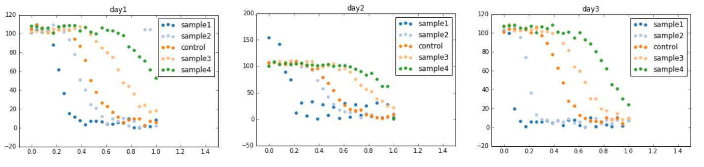
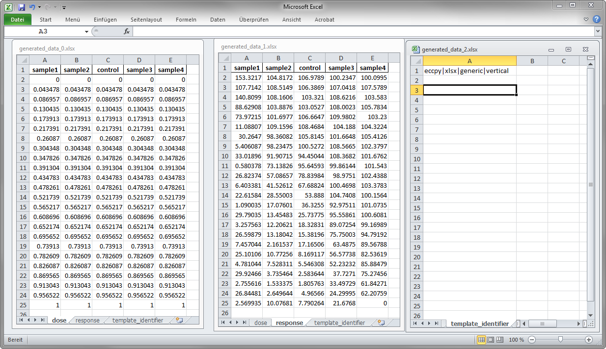
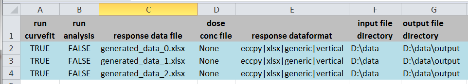
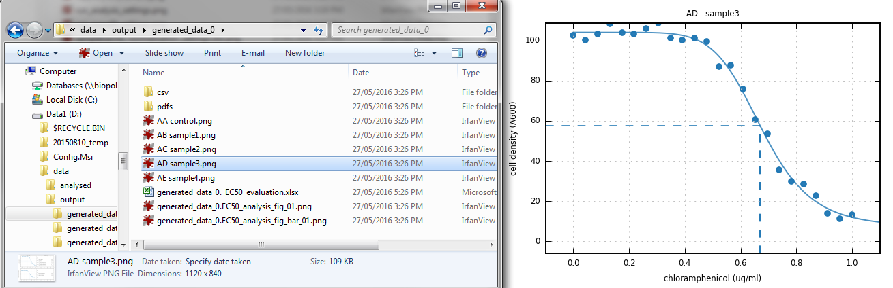
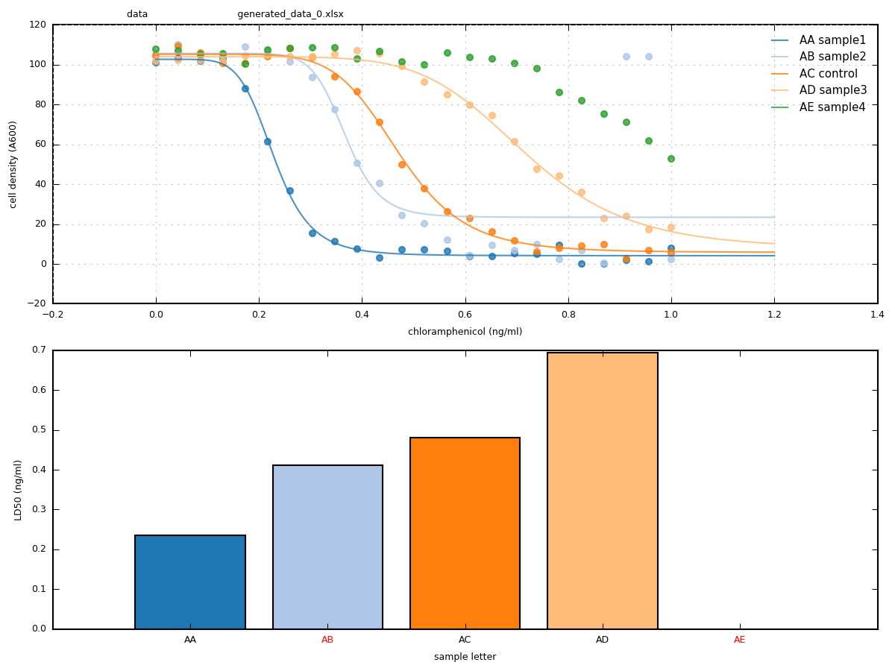
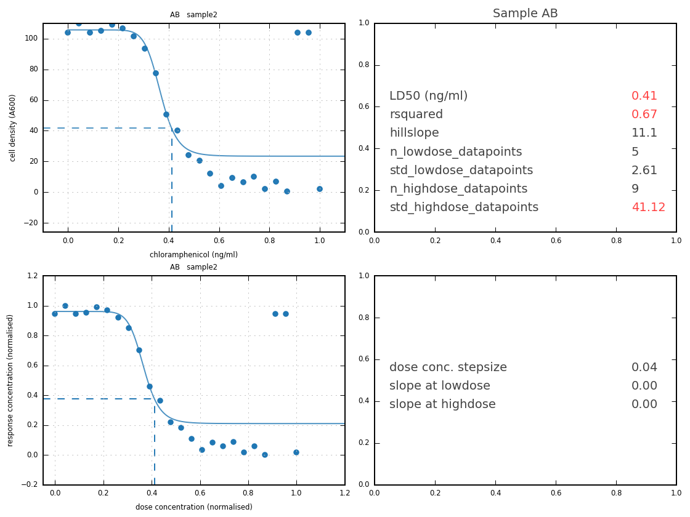
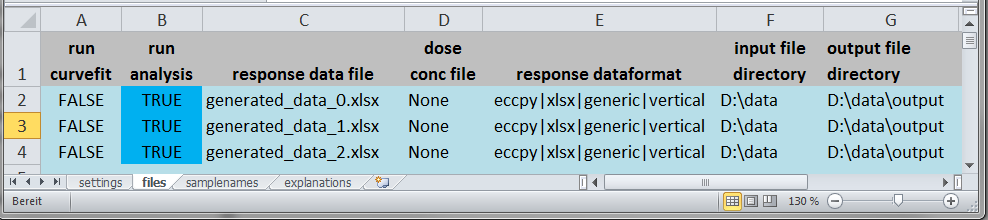
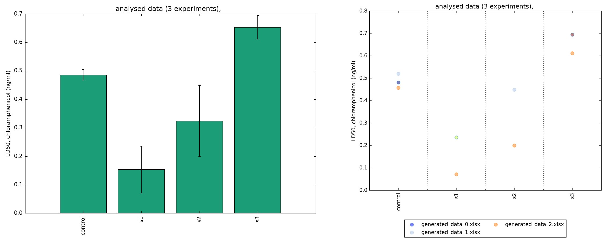
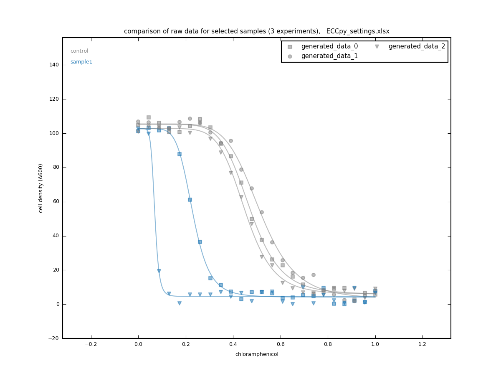

# ECCpy
ECCpy is a program for EC50 calculation in python.

# Features
 **Robust data analysis.**<br />
 - fully automated:
  - fitting of sigmoidal curves to dose-response data
  - calculation of EC50, LD50 or IC50 values.
  - high-throughput analysis
  - comparison of EC50 values from different experiments
  - calculation of EC25 or EC75 values
 - accepts REAL biological data
  - pre-filtering excludes nonsense data
  - judgefit module identifies low-quality EC50 values
 
 **Designed for humans.**<br />
 - easy-to-use excel files:
  - excel settings file 
  - excel input file with dose and response data
  - excel output file with EC50 values
 - simple graphical output:
  - sigmoidal curves with EC50 shown on graph
  - daily summary barcharts and curves

 **Customisable.**<br />
 - simple python syntax 
 - open-source software
 - built on powerful numpy, scipy, pandas and matplotlib packages

# Development status

ECCpy has been used for hundreds of LD50 assays (Z-shaped curves) by research students within the lab of Dieter Langosch at the Technical University of Munich in Germany. 

The code has been extensively updated and annotated for public release. 

However the module is still under development and is released "as is" with some known issues, limitations and legacy code. As a newly released module, some bugfixing is to be expected related to diverse operating systems, python versions, data formats, and experimental data types. 

#Installation

For new python users, we recommend installing Anaconda python 3.x, which should contain all required python modules.
https://www.continuum.io/downloads

ECCpy has been tested for python 3.5. It requires the python modules numpy, scipy, pandas, and matplotlib.

To install ECCpy itself:
 - download and unpack the module from GitHub. 
 - open the command console and navigate to the ECCpy folder that contains setup.py
 - run the following command in the console: 
   `python setup.py install`
 - if successful, ECCpy will be installed as a module, allowing the "import eccpy" statement.
 
For tips and tricks during installation, please see the Wiki (coming soon). Regularly updating of the module is recommended. The easiest way to update is with a version control system such as git.

#Usage
Here a dataset is examined that consists of four samples and a control. An LD50 experiment is repeated over three days.
(code for generating this example is shown below)

<br />
The data for each day is prepared in an excel file, to be used as ECCpy input.
The excel template contains three tabs. 1) dose, 2) response, and 3) a "template_identifier" tab that helps ECCpy identify the excel format.

<br />
An excel settings file controls all ECCpy inputs, including the list of files to examine. Update the settings file to include data files.

<br />
Run curve_fit in python or the ipython/jupyter notebook, to fit a sigmoidal curve to the dose-response data, and calculate EC50 values.
```
import eccpy
settings = r"D:\data\ECCpy_settings.xlsx"
eccpy.run_curvefit(settings)
```

<br />
The fitted curves are shown in the .png images. The list of calculated EC50 values are saved in excel and csv.

<br />
A summary figure for each day/experiment is created. Curve-fitting is accompanied by a judgefit program, that examines the quality of the curve fitting and EC50 value. Samples with a red letter code in the barchart x-axis (e.g. AB, sample 2) have been automatically judged by ECCpy as low quality..

<br />
In the list of quality filters on the right-hand-side, the red "r_squared" and "std_highdose_datapoints" show that for these filters, the fitted curve did not meet the user-defined quality threshold (as defined in the settings excel file). If the data fails to meet any of the thresholds, the EC50 is marked as red, and is excluded from the analysis program that compares data from multiple experiments. The curve is shown with both the original x- and y-axes (top left) and with normalised axes between 0 and 1 (bottom left).

<br />

In some cases, the the curve itself is annotated in red to show why the data quality is judged to be low. For example here the slope at the last datapoint is too high. Repeating the experiment with higher dose concentrations would be necessary.

<br />

The results from all three days can be compared with the run_analysis program. First mark "run_analysis" in the excel settings file as "TRUE":

<br />
run_analysis in python or the ipython/jupyter notebook.
```
import eccpy
settings = r"D:\data\ECCpy_settings.xlsx"
eccpy.run_analysis(settings)
```
<br />
The analysis program combines all high-quality EC50 values from the selected experiments, and presents the data as a barchart and scatter plot.

<br />
The compare_raw program goes through all the EC50 values calculated for the selected experiments, and compares the raw data curves for the selected samples.
```
# define which samples you want to compare, across all experiments
samples = ["control", "sample1"]
eccpy.compare_rawdata(settings_excel_file, samples)
```


 **Code to generate an example dataset for analysis.**<br />
```
import eccpy
import numpy as np
import pandas as pd
import matplotlib.pyplot as plt
% matplotlib inline
t20 = eccpy.tools.setup_t20_colour_list()
dose_values = np.linspace(0,1,24)
days = ["day1", "day2", "day3"]
samples = ["sample1", "sample2","control","sample3","sample4"]
df_dose = pd.DataFrame()
df_response = pd.DataFrame()
for i, day in enumerate(days):
    fig, ax = plt.subplots()
    ax.set_title(day)
    for n, sample in enumerate(samples):
        # add dose values
        df_dose[sample] = dose_values
        # create the hill constants for curves with EC50 offset and some randomisation
        random_offset = n*0.18 + np.random.randn()/20
        EC50 = 0.2 + random_offset
        if day == "day3":
            EC50 = EC50 - 0.1 
        hill_constants = [100, 0, EC50, 7.1]
        # generate perfect response curve
        response_curve = eccpy.tools.hill_eq(hill_constants, dose_values)
        # scatter datapoints to resemble real data. Add to dataframe and plot.
        random = np.random.random(len(dose_values)) * 10
        response_values = response_curve + random
        if day == "day1" and sample == "sample2":
            response_values[21] = (response_values.max() - response_values.min())*0.95
            response_values[22] = (response_values.max() - response_values.min())*0.95
        if day == "day2" and sample == "sample1":
            response_values[::2] = response_values[::2]*1.2 + response_values.max()/5
        if day == "day2" and sample == "sample4":
            response_values[-1] = 0
        #if day == "day2" and sample == "sample2":
        #    response_values = response_values + random
        df_response[sample] = response_values
        ax.scatter(dose_values, df_response[sample], color=t20[n],label=sample)
    ax.legend(loc="best")
    ax.set_xlim(-0.1,1.5)
    writer = pd.ExcelWriter("generated_data_{}.xlsx".format(i))
    df_dose.to_excel(writer, sheet_name="dose", index=False)
    df_response.to_excel(writer, sheet_name="response", index=False)
    template = "eccpy|xlsx|generic|vertical"
    template_identifier = pd.DataFrame(template,[0], [0])
    template_identifier.to_excel(writer, sheet_name="template_identifier", index=False, header=False)
    writer.save()
    writer.close()
```

# Contribute
If you encounter a bug or ECCpy doesn't work for any reason, please send an email to mark.teese /at/ tum.de or initiate an issue in Github.

Non-programmers can contribute by:
 - testing ECCpy with your particular datasets
 - suggesting features
 - improving the readme and documentation

Programmer contributions are very welcome:
 - adapting ECCpy for more diverse input files and datatypes. The only currently accepted input files are based on single templates of A) excel, B) BMG FluoStar C) Molecular Devices SoftMax(VersaMax).
 - adding your own desired features
 - improving code, or fixing known issues.

#License
ECCpy is free software distributed under the GNU General Public License version 3.

#Citation
Currently there in no scientific article associated with this module. If you use ECCpy in your research, please cite as follows:
"EC50 values were calculated using the open-source ECCpy module in python (Mark Teese, Technical University of Munich)."
