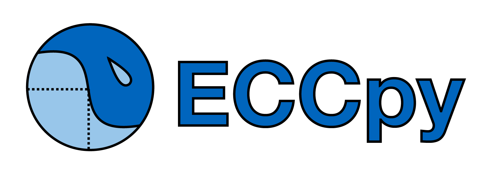

================================================
ECCpy, a program for EC50 calculation in python.
================================================

The EC50, or the "half maximal effective concentration", is a key measure of the effectiveness of a compound to affect a biological system. It is commonly used in pharmacology, biology and biochemistry. The EC50 is calculated by fitting the dose-response data to a sigmoidal curve, typically using the Hill equation. Variants include the half maximal "lethal dose" (LD50), and "inhibitor concentration" (IC50).

=========
 Features
=========
**Robust data analysis.**
 - fully automated:
  - fitting of sigmoidal curves to dose-response data
  - calculation of EC50, LD50 or IC50 values.
  - high-throughput analysis
  - comparison of EC50 values from different experiments
  - calculation of EC25 or EC75 values
 - accepts REAL biological data
  - pre-filtering excludes nonsense data
  - judgefit module identifies low-quality EC50 values

**Designed for humans.**
 - easy-to-use excel files:
  - excel settings file
  - excel input file with dose and response data
  - excel output file with EC50 values
 - simple graphical output:
  - sigmoidal curves with EC50 shown on graph
  - daily summary barcharts and curves

**Customisable.**
 - simple python syntax
 - open-source software
 - built on powerful numpy, scipy, and pandas packages

==================
Development status
==================

ECCpy has been used extensively for the analysis of LD50 assays (Z-shaped curves) by bachelor, master and PhD students within the lab of Dieter Langosch at the Technical University of Munich in Germany.

The code has been extensively updated and annotated for public release.

However the module is still under development and is released "as is" with some known issues, limitations and legacy code. As a newly released module, bugfixing related to diverse operating systems, python versions, data formats, and experimental data types should be expected.

============
Installation
============

ECCpy requires python 3.x (currently written for 3.5). We recommend the Anaconda python distribution, which contains all the required python modules (numpy, scipy, pandas and matplotlib).
https://www.continuum.io/downloads

To install ECCpy:
 - download and unpack the module from Github
 - open the command console. Navigate to the ECCpy folder that contains setup.py
 - run the following command:
   `python setup.py install`

=====
Usage
=====

Using ECCpy requires only the following:
1) Prepare your data, 2) update an excel settings file, 3) tell ECCpy to "run".

**1) Prepare your data.**
 - use the excel or microplate templates in the eccpy/templates folder
 - for the generic excel format, simply open the template and paste in your dose and response data.

**2) Update an excel settings file**
 - copy the ECCpy_settings_template.xlsx from eccpy/templates
 - open the excel file, input the name and location of your datafiles, and the desired location for your output files
 - write "TRUE" next to the files you want to examine


**3) tell ECCpy to "run".**
 - run the ipython/jupyter notebook, which opens a python interpreter in your web browser
 - paste in the following three lines. Replace the location of your settings file.
 - hit Ctrl-Enter to run
 - based on your output, adjust the quality thresholds in the settings file to suit your data
```
import eccpy
settings = r"D:\data\ECCpy_settings.xlsx"
eccpy.run_curvefit(settings)
eccpy.run_gatherer(settings)
```
====
Test
====
 - try the example excel files in the eccpy/examples folder before switching to your own data.

============
ECCpy output
============

**run_curvefit program**
 - individual dose-response curves
 - automatic judging of data quality
 - daily summary curves, barchart and more!


<br />
**run_gatherer program**
 - combines data from multiple experiments
 - excludes EC50 values that are not of sufficient quality, according to user-defined thresholds
 - bar charts with mean and SEM over all selected experiments
 - scatter plots showing individual datapoints for each day/experiment, and more!

<br /><br />
**compare_rawdata program**
 - collects raw data and dose-response curves from multiple experiments
 - compares datapoints and fitted curves between the selected samples


==========
Contribute
==========
If you encounter a bug or ECCpy doesn't work for any reason, please send an email to mark.teese /at/ tum.de or initiate an issue in Github.

Non-programmers can contribute by:
 - testing ECCpy with your particular datasets
 - suggesting features
 - improving the readme and documentation

Programmer contributions are very welcome:
 - adapting ECCpy for more diverse input files and datatypes. Currently accepted are A) excel, B) BMG FluoStar, and C) Molecular Devices SoftMax(VersaMax) files.
 - adding your own desired features
 - improving code, or fixing known issues.
==========
License
==========
ECCpy is free software distributed under the GNU General Public License version 3.

========
Citation
========
Currently there in no scientific article associated with this module. If you use ECCpy in your research, please cite as follows:
"EC50 values were calculated using the open-source ECCpy module in python (Mark Teese, Technical University of Munich)."
